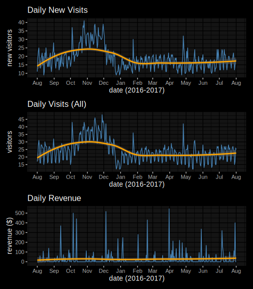
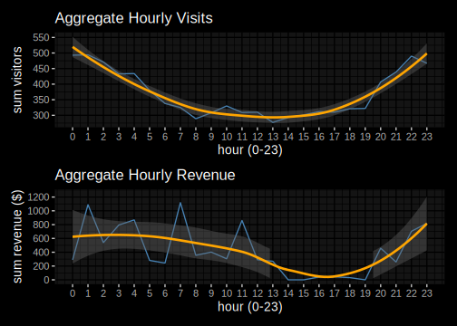
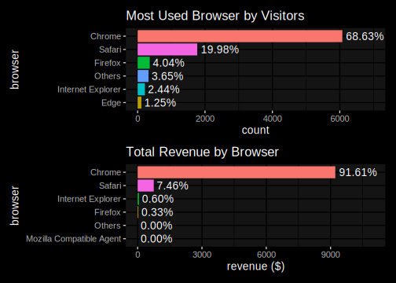
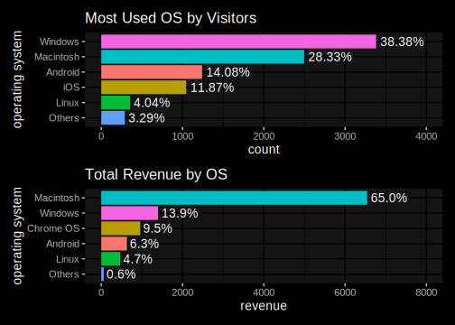
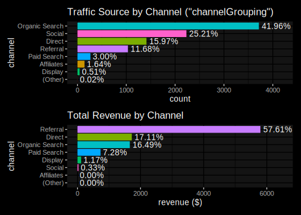
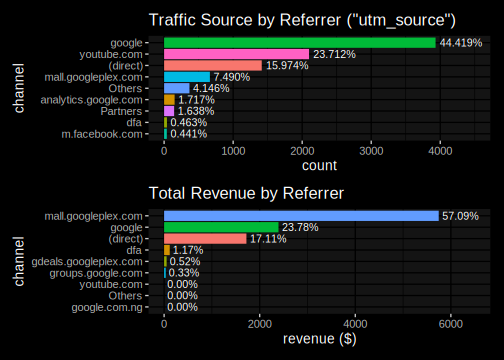
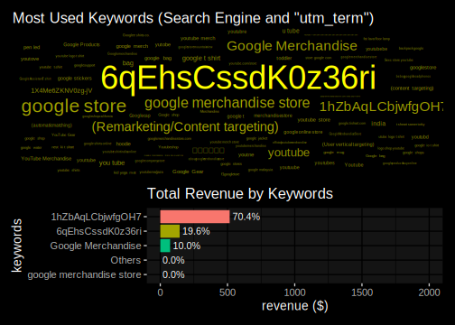
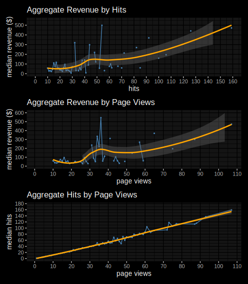

# GA - Google Merchandise Store Analysis
AndhikaWB
July 28, 2024

# Preparation

## Initial Setup

Make sure you already have [R](https://cran.r-project.org/bin/)
installed, and also the R extension if you’re using [R on VS
Code](https://code.visualstudio.com/docs/languages/r)

Quarto markdown (.qmd) has better support than R markdown (.rmd) on VS
Code. See the [get started](https://quarto.org/docs/get-started/),
[formatting](https://quarto.org/docs/computations/r.html), and
[execution](https://quarto.org/docs/computations/execution-options.html)
docs for starter

Note that the .qmd file itself is just a template that needs to be
knitted/compiled in order to produce the real .md file

## Overview

In [this
competition](https://www.kaggle.com/competitions/ga-customer-revenue-prediction),
you’re challenged to analyze a Google Merchandise Store (also known as
GStore, where Google swag is sold) customer dataset to predict revenue
per customer. Hopefully, the outcome will be more actionable operational
changes and a better use of marketing budgets for those companies who
choose to use data analysis on top of GA data

## Library and Data Preparation

Load library

``` r
# Read from file (read_csv, etc)
library(readr)
# Data manipulation (mutate, group_by, etc)
library(dplyr)
# Data cleaning (unnest, etc)
library(tidyr)
# Data conditioning (map, keep, etc)
library(purrr)
# Parse/write JSON (parseJSON, etc)
library(jsonlite)
# See NA, N-unique, etc from data (skim)
library(skimr)
# Time manipulation (ymd, hour, etc)
library(lubridate)
# String manipulation (str_replace, etc)
library(stringr)

# Data visualization
library(ggplot2)
library(ggdark)
theme_set(dark_theme_gray())
# Easily combine multiple plot
library(patchwork)
# Word cloud for ggplot
library(ggwordcloud)
# Label auto scaling (percent, etc)
library(scales)

# Map data for ggplot
library(maps)
# Country name standardization
library(countrycode)
```

Load train and test data

``` r
# If it's too slow, use "n_max" argument to limit the rows
df_train <- read_csv('data/train.csv.zip')
df_test <- read_csv('data/test.csv.zip')

# Check if it's a Tibble
class(df_train)
```

    [1] "spec_tbl_df" "tbl_df"      "tbl"         "data.frame" 

Preview the raw data

``` r
cat('Train set dimension:', dim(df_train), '\n')
cat('Test set dimension:', dim(df_test), '\n')

glimpse(df_train)
```

    Train set dimension: 903653 12 
    Test set dimension: 804684 12 
    Rows: 903,653
    Columns: 12
    $ channelGrouping      <chr> "Organic Search", "Organic Search", "Organic Sear…
    $ date                 <dbl> 20160902, 20160902, 20160902, 20160902, 20160902,…
    $ device               <chr> "{\"browser\": \"Chrome\", \"browserVersion\": \"…
    $ fullVisitorId        <chr> "1131660440785968503", "377306020877927890", "389…
    $ geoNetwork           <chr> "{\"continent\": \"Asia\", \"subContinent\": \"We…
    $ sessionId            <chr> "1131660440785968503_1472830385", "37730602087792…
    $ socialEngagementType <chr> "Not Socially Engaged", "Not Socially Engaged", "…
    $ totals               <chr> "{\"visits\": \"1\", \"hits\": \"1\", \"pageviews…
    $ trafficSource        <chr> "{\"campaign\": \"(not set)\", \"source\": \"goog…
    $ visitId              <dbl> 1472830385, 1472880147, 1472865386, 1472881213, 1…
    $ visitNumber          <dbl> 1, 1, 1, 1, 2, 1, 1, 1, 1, 1, 1, 1, 1, 1, 1, 1, 1…
    $ visitStartTime       <dbl> 1472830385, 1472880147, 1472865386, 1472881213, 1…

## Data Preprocessing

Take a stratified sample from each day

``` r
# For reproducibility
set.seed(1337)

# 0.01 = 1% of data
df_train <- df_train %>%
  group_by(date) %>%
  slice_sample(prop = 0.01) %>%
  ungroup

df_test <- df_test %>%
  group_by(date) %>%
  slice_sample(prop = 0.01) %>%
  ungroup

cat('Train set dimension (after sampling):', dim(df_train), '\n')
cat('Test set dimension (after sampling):', dim(df_test), '\n')
```

    Train set dimension (after sampling): 8853 12 
    Test set dimension (after sampling): 7909 12 

Wrap both data into a list

``` r
# Wrap both data into a list for easier modification (e.g. using loop)
# We can't do this earlier due to list size limitation
dfl <- list(train = df_train, test = df_test)
rm(df_train, df_test)
```

Fix data types

``` r
# We use [[]] if we want to access column/element name using string
# So instead of "dfl$train$date" we can use "dfl[['train']]$date"

# Loop both train and test data
for (df in names(dfl)) {
  # Fix date recognized as double
  dfl[[df]]$date <- as.Date.character(dfl[[df]]$date, format = '%Y%m%d')
  # Convert timestamp to datetime
  dfl[[df]]$visitStartTime <- as.POSIXct(dfl[[df]]$visitStartTime)
}

glimpse(dfl$train)
```

    Rows: 8,853
    Columns: 12
    $ channelGrouping      <chr> "Organic Search", "Social", "Direct", "Referral",…
    $ date                 <date> 2016-08-01, 2016-08-01, 2016-08-01, 2016-08-01, …
    $ device               <chr> "{\"browser\": \"Chrome\", \"browserVersion\": \"…
    $ fullVisitorId        <chr> "8846289716943240767", "1080407219030471072", "14…
    $ geoNetwork           <chr> "{\"continent\": \"Europe\", \"subContinent\": \"…
    $ sessionId            <chr> "8846289716943240767_1470082536", "10804072190304…
    $ socialEngagementType <chr> "Not Socially Engaged", "Not Socially Engaged", "…
    $ totals               <chr> "{\"visits\": \"1\", \"hits\": \"2\", \"pageviews…
    $ trafficSource        <chr> "{\"campaign\": \"(not set)\", \"source\": \"goog…
    $ visitId              <dbl> 1470082536, 1470035660, 1470092775, 1470074146, 1…
    $ visitNumber          <dbl> 1, 1, 2, 7, 1, 1, 1, 1, 1, 1, 3, 4, 40, 1, 3, 1, …
    $ visitStartTime       <dttm> 2016-08-02 03:15:36, 2016-08-01 14:14:20, 2016-0…

Un-nest JSON columns as separate columns

``` r
parseJSON <- function(df, col_name) {
  # Parse column as true JSON object
  # The comma and brackets are necessary for a valid JSON
  paste(df[[col_name]], collapse = ',') %>%
    paste('[', ., ']') %>% fromJSON
}

for (df in names(dfl)) {
  for (col in c('device', 'geoNetwork', 'totals', 'trafficSource')) {
    dfl[[df]] <- dfl[[df]] %>%
      # Without !! and := the mutate column name will always be "col"
      mutate(!!col := parseJSON(.data, col)) %>%
      unnest(cols = c(col), names_sep = '.')
  }
}

# trafficSource also has other nested children (adwordsClickInfo)
# This will cause error later so we need to un-nest them all
unnest_all <- function(df) {
  cols <- keep(df, is.data.frame) %>% colnames
  if (length(cols) == 0) return(df)
  # Un-nest again if still nested
  df <- df %>% unnest(cols = cols, names_sep = '.')
  return(unnest_all(df))
}

for (df in names(dfl)) {
  dfl[[df]] <- dfl[[df]] %>% unnest_all
}

glimpse(dfl$train)
```

    Rows: 8,853
    Columns: 54
    $ channelGrouping                                   <chr> "Organic Search", "S…
    $ date                                              <date> 2016-08-01, 2016-08…
    $ device.browser                                    <chr> "Chrome", "Safari", …
    $ device.browserVersion                             <chr> "not available in de…
    $ device.browserSize                                <chr> "not available in de…
    $ device.operatingSystem                            <chr> "Windows", "Macintos…
    $ device.operatingSystemVersion                     <chr> "not available in de…
    $ device.isMobile                                   <lgl> FALSE, FALSE, FALSE,…
    $ device.mobileDeviceBranding                       <chr> "not available in de…
    $ device.mobileDeviceModel                          <chr> "not available in de…
    $ device.mobileInputSelector                        <chr> "not available in de…
    $ device.mobileDeviceInfo                           <chr> "not available in de…
    $ device.mobileDeviceMarketingName                  <chr> "not available in de…
    $ device.flashVersion                               <chr> "not available in de…
    $ device.language                                   <chr> "not available in de…
    $ device.screenColors                               <chr> "not available in de…
    $ device.screenResolution                           <chr> "not available in de…
    $ device.deviceCategory                             <chr> "desktop", "desktop"…
    $ fullVisitorId                                     <chr> "8846289716943240767…
    $ geoNetwork.continent                              <chr> "Europe", "Americas"…
    $ geoNetwork.subContinent                           <chr> "Western Europe", "N…
    $ geoNetwork.country                                <chr> "Germany", "United S…
    $ geoNetwork.region                                 <chr> "not available in de…
    $ geoNetwork.metro                                  <chr> "not available in de…
    $ geoNetwork.city                                   <chr> "not available in de…
    $ geoNetwork.cityId                                 <chr> "not available in de…
    $ geoNetwork.networkDomain                          <chr> "(not set)", "(not s…
    $ geoNetwork.latitude                               <chr> "not available in de…
    $ geoNetwork.longitude                              <chr> "not available in de…
    $ geoNetwork.networkLocation                        <chr> "not available in de…
    $ sessionId                                         <chr> "8846289716943240767…
    $ socialEngagementType                              <chr> "Not Socially Engage…
    $ totals.visits                                     <chr> "1", "1", "1", "1", …
    $ totals.hits                                       <chr> "2", "1", "1", "3", …
    $ totals.pageviews                                  <chr> "2", "1", "1", "3", …
    $ totals.newVisits                                  <chr> "1", "1", NA, NA, "1…
    $ totals.bounces                                    <chr> NA, "1", "1", NA, NA…
    $ totals.transactionRevenue                         <chr> NA, NA, NA, NA, NA, …
    $ trafficSource.campaign                            <chr> "(not set)", "(not s…
    $ trafficSource.source                              <chr> "google", "youtube.c…
    $ trafficSource.medium                              <chr> "organic", "referral…
    $ trafficSource.keyword                             <chr> "(not provided)", NA…
    $ trafficSource.adwordsClickInfo.criteriaParameters <chr> "not available in de…
    $ trafficSource.adwordsClickInfo.page               <chr> NA, NA, NA, NA, NA, …
    $ trafficSource.adwordsClickInfo.slot               <chr> NA, NA, NA, NA, NA, …
    $ trafficSource.adwordsClickInfo.gclId              <chr> NA, NA, NA, NA, NA, …
    $ trafficSource.adwordsClickInfo.adNetworkType      <chr> NA, NA, NA, NA, NA, …
    $ trafficSource.adwordsClickInfo.isVideoAd          <lgl> NA, NA, NA, NA, NA, …
    $ trafficSource.referralPath                        <chr> NA, "/yt/about/", NA…
    $ trafficSource.isTrueDirect                        <lgl> NA, NA, TRUE, TRUE, …
    $ trafficSource.adContent                           <chr> NA, NA, NA, NA, NA, …
    $ visitId                                           <dbl> 1470082536, 14700356…
    $ visitNumber                                       <dbl> 1, 1, 2, 7, 1, 1, 1,…
    $ visitStartTime                                    <dttm> 2016-08-02 03:15:36…

Standardize various NA values

``` r
na_vals <- c(
  'unknown.unknown', '(not set)', '(not provided)',
  'not available in demo dataset', '(none)', '<NA>', ''
)

for (df in names(dfl)) {
  for (col in colnames(dfl[[df]])) {
    # Note: sapply may change the column class type (e.g. date to double)
    # Hence we only check string columns to avoid unecessary conversion
    if (is.character(dfl[[df]][[col]])) {
      dfl[[df]][[col]] <- dfl[[df]][[col]] %>%
        sapply(., function(x) {
          # Replace all NA variants with standard NA
          replace(x, x %in% na_vals, NA)
        })
    }
  }
}

glimpse(dfl$train)
```

    Rows: 8,853
    Columns: 54
    $ channelGrouping                                   <chr> "Organic Search", "S…
    $ date                                              <date> 2016-08-01, 2016-08…
    $ device.browser                                    <chr> "Chrome", "Safari", …
    $ device.browserVersion                             <chr> NA, NA, NA, NA, NA, …
    $ device.browserSize                                <chr> NA, NA, NA, NA, NA, …
    $ device.operatingSystem                            <chr> "Windows", "Macintos…
    $ device.operatingSystemVersion                     <chr> NA, NA, NA, NA, NA, …
    $ device.isMobile                                   <lgl> FALSE, FALSE, FALSE,…
    $ device.mobileDeviceBranding                       <chr> NA, NA, NA, NA, NA, …
    $ device.mobileDeviceModel                          <chr> NA, NA, NA, NA, NA, …
    $ device.mobileInputSelector                        <chr> NA, NA, NA, NA, NA, …
    $ device.mobileDeviceInfo                           <chr> NA, NA, NA, NA, NA, …
    $ device.mobileDeviceMarketingName                  <chr> NA, NA, NA, NA, NA, …
    $ device.flashVersion                               <chr> NA, NA, NA, NA, NA, …
    $ device.language                                   <chr> NA, NA, NA, NA, NA, …
    $ device.screenColors                               <chr> NA, NA, NA, NA, NA, …
    $ device.screenResolution                           <chr> NA, NA, NA, NA, NA, …
    $ device.deviceCategory                             <chr> "desktop", "desktop"…
    $ fullVisitorId                                     <chr> "8846289716943240767…
    $ geoNetwork.continent                              <chr> "Europe", "Americas"…
    $ geoNetwork.subContinent                           <chr> "Western Europe", "N…
    $ geoNetwork.country                                <chr> "Germany", "United S…
    $ geoNetwork.region                                 <chr> NA, NA, "California"…
    $ geoNetwork.metro                                  <chr> NA, NA, "San Francis…
    $ geoNetwork.city                                   <chr> NA, NA, "Mountain Vi…
    $ geoNetwork.cityId                                 <chr> NA, NA, NA, NA, NA, …
    $ geoNetwork.networkDomain                          <chr> NA, NA, "intuit.com"…
    $ geoNetwork.latitude                               <chr> NA, NA, NA, NA, NA, …
    $ geoNetwork.longitude                              <chr> NA, NA, NA, NA, NA, …
    $ geoNetwork.networkLocation                        <chr> NA, NA, NA, NA, NA, …
    $ sessionId                                         <chr> "8846289716943240767…
    $ socialEngagementType                              <chr> "Not Socially Engage…
    $ totals.visits                                     <chr> "1", "1", "1", "1", …
    $ totals.hits                                       <chr> "2", "1", "1", "3", …
    $ totals.pageviews                                  <chr> "2", "1", "1", "3", …
    $ totals.newVisits                                  <chr> "1", "1", NA, NA, "1…
    $ totals.bounces                                    <chr> NA, "1", "1", NA, NA…
    $ totals.transactionRevenue                         <chr> NA, NA, NA, NA, NA, …
    $ trafficSource.campaign                            <chr> NA, NA, NA, NA, NA, …
    $ trafficSource.source                              <chr> "google", "youtube.c…
    $ trafficSource.medium                              <chr> "organic", "referral…
    $ trafficSource.keyword                             <chr> NA, NA, NA, NA, NA, …
    $ trafficSource.adwordsClickInfo.criteriaParameters <chr> NA, NA, NA, NA, NA, …
    $ trafficSource.adwordsClickInfo.page               <chr> NA, NA, NA, NA, NA, …
    $ trafficSource.adwordsClickInfo.slot               <chr> NA, NA, NA, NA, NA, …
    $ trafficSource.adwordsClickInfo.gclId              <chr> NA, NA, NA, NA, NA, …
    $ trafficSource.adwordsClickInfo.adNetworkType      <chr> NA, NA, NA, NA, NA, …
    $ trafficSource.adwordsClickInfo.isVideoAd          <lgl> NA, NA, NA, NA, NA, …
    $ trafficSource.referralPath                        <chr> NA, "/yt/about/", NA…
    $ trafficSource.isTrueDirect                        <lgl> NA, NA, TRUE, TRUE, …
    $ trafficSource.adContent                           <chr> NA, NA, NA, NA, NA, …
    $ visitId                                           <dbl> 1470082536, 14700356…
    $ visitNumber                                       <dbl> 1, 1, 2, 7, 1, 1, 1,…
    $ visitStartTime                                    <dttm> 2016-08-02 03:15:36…

See data summary (unique values, NA, etc)

``` r
skim(dfl$train) %>%
  # Without "focus", all details will be shown
  focus(
    n_missing,
    # Note that N-unique doesn't include NA
    character.n_unique,
    logical.count,
    # Median (percentile 50)
    numeric.p50,
    numeric.mean,
    Date.min,
    Date.max
  ) %>%
  print()
```

    ── Data Summary ────────────────────────
                               Values   
    Name                       dfl$train
    Number of rows             8853     
    Number of columns          54       
    _______________________             
    Column type frequency:              
      character                47       
      Date                     1        
      logical                  3        
      numeric                  2        
      POSIXct                  1        
    ________________________            
    Group variables            None     

    ── Variable type: character ────────────────────────────────────────────────────
       skim_variable                                     n_missing n_unique
     1 channelGrouping                                           0        8
     2 device.browser                                            0       22
     3 device.browserVersion                                  8853        0
     4 device.browserSize                                     8853        0
     5 device.operatingSystem                                   42       12
     6 device.operatingSystemVersion                          8853        0
     7 device.mobileDeviceBranding                            8853        0
     8 device.mobileDeviceModel                               8853        0
     9 device.mobileInputSelector                             8853        0
    10 device.mobileDeviceInfo                                8853        0
    11 device.mobileDeviceMarketingName                       8853        0
    12 device.flashVersion                                    8853        0
    13 device.language                                        8853        0
    14 device.screenColors                                    8853        0
    15 device.screenResolution                                8853        0
    16 device.deviceCategory                                     0        3
    17 fullVisitorId                                             0     8784
    18 geoNetwork.continent                                     15        5
    19 geoNetwork.subContinent                                  15       22
    20 geoNetwork.country                                       15      130
    21 geoNetwork.region                                      5215      199
    22 geoNetwork.metro                                       6909       49
    23 geoNetwork.city                                        5281      263
    24 geoNetwork.cityId                                      8853        0
    25 geoNetwork.networkDomain                               3880     1469
    26 geoNetwork.latitude                                    8853        0
    27 geoNetwork.longitude                                   8853        0
    28 geoNetwork.networkLocation                             8853        0
    29 sessionId                                                 0     8853
    30 socialEngagementType                                      0        1
    31 totals.visits                                             0        1
    32 totals.hits                                               0       88
    33 totals.pageviews                                          2       68
    34 totals.newVisits                                       1958        1
    35 totals.bounces                                         4438        1
    36 totals.transactionRevenue                              8750      100
    37 trafficSource.campaign                                 8479        5
    38 trafficSource.source                                      1       72
    39 trafficSource.medium                                   1416        5
    40 trafficSource.keyword                                  8494       99
    41 trafficSource.adwordsClickInfo.criteriaParameters      8853        0
    42 trafficSource.adwordsClickInfo.page                    8627        2
    43 trafficSource.adwordsClickInfo.slot                    8627        2
    44 trafficSource.adwordsClickInfo.gclId                   8626      227
    45 trafficSource.adwordsClickInfo.adNetworkType           8627        1
    46 trafficSource.referralPath                             5587      178
    47 trafficSource.adContent                                8732       13

    ── Variable type: Date ─────────────────────────────────────────────────────────
      skim_variable n_missing min        max       
    1 date                  0 2016-08-01 2017-08-01

    ── Variable type: logical ──────────────────────────────────────────────────────
      skim_variable                            n_missing count               
    1 device.isMobile                                  0 FAL: 6485, TRU: 2368
    2 trafficSource.adwordsClickInfo.isVideoAd      8627 FAL: 226            
    3 trafficSource.isTrueDirect                    6146 TRU: 2707           

    ── Variable type: numeric ──────────────────────────────────────────────────────
      skim_variable n_missing        p50          mean
    1 visitId               0 1483875404 1484986207.  
    2 visitNumber           0          1          2.23

    ── Variable type: POSIXct ──────────────────────────────────────────────────────
      skim_variable  n_missing
    1 visitStartTime         0

Remove columns that only have 1 possible value and show the rest

``` r
for (col in colnames(dfl$train)) {
  if (length(unique(dfl$train[[col]])) == 1) {
    dfl$train[[col]] <- NULL
    dfl$test[[col]] <- NULL
  }
}

cat('Number of rows:', dim(dfl$train)[1], '\n')

# Show possible values except NA
# If length < number of rows then the rest are NA
dfl$train %>%
  as.list %>%
  rapply(na.omit, how = 'replace') %>%
  str(give.attr = FALSE)
```

    Number of rows: 8853 
    List of 35
     $ channelGrouping                             : Named chr [1:8853] "Organic Search" "Social" "Direct" "Referral" ...
     $ date                                        : Date[1:8853], format: "2016-08-01" "2016-08-01" ...
     $ device.browser                              : Named chr [1:8853] "Chrome" "Safari" "Chrome" "Chrome" ...
     $ device.operatingSystem                      : Named chr [1:8811] "Windows" "Macintosh" "Windows" "Linux" ...
     $ device.isMobile                             : logi [1:8853] FALSE FALSE FALSE FALSE FALSE FALSE ...
     $ device.deviceCategory                       : Named chr [1:8853] "desktop" "desktop" "desktop" "desktop" ...
     $ fullVisitorId                               : Named chr [1:8853] "8846289716943240767" "1080407219030471072" "1492217702561732960" "4005605575873365444" ...
     $ geoNetwork.continent                        : Named chr [1:8838] "Europe" "Americas" "Americas" "Americas" ...
     $ geoNetwork.subContinent                     : Named chr [1:8838] "Western Europe" "Northern America" "Northern America" "Northern America" ...
     $ geoNetwork.country                          : Named chr [1:8838] "Germany" "United States" "United States" "United States" ...
     $ geoNetwork.region                           : Named chr [1:3638] "California" "New York" "District of Columbia" "California" ...
     $ geoNetwork.metro                            : Named chr [1:1944] "San Francisco-Oakland-San Jose CA" "New York NY" "Washington DC (Hagerstown MD)" "San Francisco-Oakland-San Jose CA" ...
     $ geoNetwork.city                             : Named chr [1:3572] "Mountain View" "New York" "Washington" "Mountain View" ...
     $ geoNetwork.networkDomain                    : Named chr [1:4973] "intuit.com" "comcastbusiness.net" "ihug.co.nz" "skyebankng.com" ...
     $ sessionId                                   : Named chr [1:8853] "8846289716943240767_1470082536" "1080407219030471072_1470035660" "1492217702561732960_1470092775" "4005605575873365444_1470074146" ...
     $ totals.hits                                 : Named chr [1:8853] "2" "1" "1" "3" ...
     $ totals.pageviews                            : Named chr [1:8851] "2" "1" "1" "3" ...
     $ totals.newVisits                            : Named chr [1:6895] "1" "1" "1" "1" ...
     $ totals.bounces                              : Named chr [1:4415] "1" "1" "1" "1" ...
     $ totals.transactionRevenue                   : Named chr [1:103] "60430000" "108460000" "23490000" "43930000" ...
     $ trafficSource.campaign                      : Named chr [1:374] "AW - Electronics" "Data Share Promo" "Data Share Promo" "Data Share Promo" ...
     $ trafficSource.source                        : Named chr [1:8852] "google" "youtube.com" "(direct)" "mall.googleplex.com" ...
     $ trafficSource.medium                        : Named chr [1:7437] "organic" "referral" "referral" "organic" ...
     $ trafficSource.keyword                       : Named chr [1:359] "+google +merchandise +store" "Merchandise" "6qEhsCssdK0z36ri" "6qEhsCssdK0z36ri" ...
     $ trafficSource.adwordsClickInfo.page         : Named chr [1:226] "1" "1" "1" "1" ...
     $ trafficSource.adwordsClickInfo.slot         : Named chr [1:226] "RHS" "Top" "Top" "Top" ...
     $ trafficSource.adwordsClickInfo.gclId        : Named chr [1:227] "CPSfsJuXgM4CFQGRfgodWFYBxA" "CjwKEAjwlZa9BRCw7cS66eTxlCkSJAC-ddmwuOTvrCXZl5rsil9U2IgE_GOnYE-jhYjv1A_23cRniRoCIWLw_wcB" "CP_AvfOrtc4CFQesaQodwlELTg" "Cj0KEQjw88q9BRDB5qLcwLXr7_sBEiQAZsGja1WElo8ySvak0pccQmxuDJGy0W3ouFrJxceb5i91NJ0aAjOW8P8HAQ" ...
     $ trafficSource.adwordsClickInfo.adNetworkType: Named chr [1:226] "Google Search" "Google Search" "Google Search" "Google Search" ...
     $ trafficSource.adwordsClickInfo.isVideoAd    : logi [1:226] FALSE FALSE FALSE FALSE FALSE FALSE ...
     $ trafficSource.referralPath                  : Named chr [1:3266] "/yt/about/" "/" "/permissions/using-the-logo.html" "/" ...
     $ trafficSource.isTrueDirect                  : logi [1:2707] TRUE TRUE TRUE TRUE TRUE TRUE ...
     $ trafficSource.adContent                     : Named chr [1:121] "Google Merchandise" "Full auto ad IMAGE ONLY" "Full auto ad IMAGE ONLY" "{KeyWord:Google Brand Items}" ...
     $ visitId                                     : num [1:8853] 1.47e+09 1.47e+09 1.47e+09 1.47e+09 1.47e+09 ...
     $ visitNumber                                 : num [1:8853] 1 1 2 7 1 1 1 1 1 1 ...
     $ visitStartTime                              : POSIXct[1:8853], format: "2016-08-02 03:15:36" "2016-08-01 14:14:20" ...

Remove other useless columns (subjectively). See column reference from
[BigQuery Export
schema](https://support.google.com/analytics/answer/3437719)

``` r
rm_cols <- c(
  # isMobile is enough
  'device.deviceCategory',
  # Country, region, city are enough
  'geoNetwork.continent',
  'geoNetwork.subContinent',
  'geoNetwork.metro',
  # Can be substituted by pageViews
  'totals.bounces',
  # Always unique, use fullVisitorId instead
  'sessionId',
  # visitId is also almost always unique
  # However, I still think fullVisitorId is enough
  'visitId',
  # Always unique, creativeId or campaignId would more helpful
  'trafficSource.adwordsClickInfo.gclId',
  # Only false or NA (no "true" value)
  'trafficSource.adwordsClickInfo.isVideoAd'
)

for (col in rm_cols) {
  dfl$train[[col]] <- NULL
  dfl$test[[col]] <- NULL
}

cat('Number of rows:', dim(dfl$train)[1], '\n')

dfl$train %>%
  as.list %>%
  rapply(na.omit, how = 'replace') %>%
  str(give.attr = FALSE)
```

    Number of rows: 8853 
    List of 26
     $ channelGrouping                             : Named chr [1:8853] "Organic Search" "Social" "Direct" "Referral" ...
     $ date                                        : Date[1:8853], format: "2016-08-01" "2016-08-01" ...
     $ device.browser                              : Named chr [1:8853] "Chrome" "Safari" "Chrome" "Chrome" ...
     $ device.operatingSystem                      : Named chr [1:8811] "Windows" "Macintosh" "Windows" "Linux" ...
     $ device.isMobile                             : logi [1:8853] FALSE FALSE FALSE FALSE FALSE FALSE ...
     $ fullVisitorId                               : Named chr [1:8853] "8846289716943240767" "1080407219030471072" "1492217702561732960" "4005605575873365444" ...
     $ geoNetwork.country                          : Named chr [1:8838] "Germany" "United States" "United States" "United States" ...
     $ geoNetwork.region                           : Named chr [1:3638] "California" "New York" "District of Columbia" "California" ...
     $ geoNetwork.city                             : Named chr [1:3572] "Mountain View" "New York" "Washington" "Mountain View" ...
     $ geoNetwork.networkDomain                    : Named chr [1:4973] "intuit.com" "comcastbusiness.net" "ihug.co.nz" "skyebankng.com" ...
     $ totals.hits                                 : Named chr [1:8853] "2" "1" "1" "3" ...
     $ totals.pageviews                            : Named chr [1:8851] "2" "1" "1" "3" ...
     $ totals.newVisits                            : Named chr [1:6895] "1" "1" "1" "1" ...
     $ totals.transactionRevenue                   : Named chr [1:103] "60430000" "108460000" "23490000" "43930000" ...
     $ trafficSource.campaign                      : Named chr [1:374] "AW - Electronics" "Data Share Promo" "Data Share Promo" "Data Share Promo" ...
     $ trafficSource.source                        : Named chr [1:8852] "google" "youtube.com" "(direct)" "mall.googleplex.com" ...
     $ trafficSource.medium                        : Named chr [1:7437] "organic" "referral" "referral" "organic" ...
     $ trafficSource.keyword                       : Named chr [1:359] "+google +merchandise +store" "Merchandise" "6qEhsCssdK0z36ri" "6qEhsCssdK0z36ri" ...
     $ trafficSource.adwordsClickInfo.page         : Named chr [1:226] "1" "1" "1" "1" ...
     $ trafficSource.adwordsClickInfo.slot         : Named chr [1:226] "RHS" "Top" "Top" "Top" ...
     $ trafficSource.adwordsClickInfo.adNetworkType: Named chr [1:226] "Google Search" "Google Search" "Google Search" "Google Search" ...
     $ trafficSource.referralPath                  : Named chr [1:3266] "/yt/about/" "/" "/permissions/using-the-logo.html" "/" ...
     $ trafficSource.isTrueDirect                  : logi [1:2707] TRUE TRUE TRUE TRUE TRUE TRUE ...
     $ trafficSource.adContent                     : Named chr [1:121] "Google Merchandise" "Full auto ad IMAGE ONLY" "Full auto ad IMAGE ONLY" "{KeyWord:Google Brand Items}" ...
     $ visitNumber                                 : num [1:8853] 1 1 2 7 1 1 1 1 1 1 ...
     $ visitStartTime                              : POSIXct[1:8853], format: "2016-08-02 03:15:36" "2016-08-01 14:14:20" ...

Fix data types (from character)

``` r
for (df in names(dfl)) {
  # # Keep as character because min, max, etc is not useful for id
  # dfl[[df]]$fullVisitorId <- as.integer(dfl[[df]]$fullVisitorId)

  # newVisits should actually be a boolean (logical)
  # However, "1" (character) when converted to logical will result to NA
  # While "1" to integer will result to 1 (as it should be)
  dfl[[df]]$totals.newVisits <- as.integer(dfl[[df]]$totals.newVisits)

  dfl[[df]]$totals.hits <- as.integer(dfl[[df]]$totals.hits)
  dfl[[df]]$totals.pageviews <- as.integer(dfl[[df]]$totals.pageviews)
  dfl[[df]]$trafficSource.adwordsClickInfo.page <- as.integer(dfl[[df]]$trafficSource.adwordsClickInfo.page)

  if (df != 'test') {
    # The transactionRevenue column doesn't exist on test data
    # We use numeric (double) in case of integer overflow
    dfl[[df]]$totals.transactionRevenue <- as.numeric(dfl[[df]]$totals.transactionRevenue)
    # Divide by 1,000,000 (as real USD)
    # https://www.kaggle.com/c/ga-customer-revenue-prediction/discussion/65775
    dfl[[df]]$totals.transactionRevenue <- dfl[[df]]$totals.transactionRevenue / 1e+06
  }
}
```

Check column consistenty between train and test data

``` r
# If only the transactionRevenue is missing, then you're good
setdiff(colnames(dfl$train), colnames(dfl$test))
```

    [1] "totals.transactionRevenue"

# Data Visualization

Plot daily visits and revenue

``` r
df <- dfl$train %>%
  group_by(date) %>%
  summarise(
    count = n(),
    revenue = sum(totals.transactionRevenue, na.rm = TRUE),
    newVisits = sum(totals.newVisits, na.rm = TRUE)
  )

g1 <- df %>%
  ggplot(aes(x = date, y = newVisits)) +
  geom_line(color = 'steelblue') +
  geom_smooth(color = 'orange') +
  scale_x_date(date_breaks = 'months', date_labels = '%b') +
  scale_y_continuous(n.breaks = 10) +
  labs(title = 'Daily New Visits', x = 'date (2016-2017)', y = 'new visitors')

g2 <- df %>%
  ggplot(aes(x = date, y = count)) +
  geom_line(color = 'steelblue') +
  geom_smooth(color = 'orange') +
  scale_x_date(date_breaks = 'months', date_labels = '%b') +
  scale_y_continuous(n.breaks = 10) +
  labs(title = 'Daily Visits (All)', x = 'date (2016-2017)', y = 'visitors')

g3 <- df %>%
  ggplot(aes(x = date, y = revenue)) +
  geom_line(color = 'steelblue') +
  geom_smooth(color = 'orange') +
  scale_x_date(date_breaks = 'months', date_labels = '%b') +
  scale_y_continuous(n.breaks = 10) +
  labs(title = 'Daily Revenue', x = 'date (2016-2017)', y = 'revenue ($)')

g1 / g2 / g3
```



Plot hourly visits and revenue

``` r
df <- dfl$train %>%
  mutate(visitHour = hour(visitStartTime)) %>%
  group_by(visitHour) %>%
  summarise(
    count = n(),
    revenue = sum(totals.transactionRevenue, na.rm = TRUE)
  )

g1 <- df %>%
  ggplot(aes(x = visitHour, y = count)) +
  geom_line(color = 'steelblue') +
  geom_smooth(color = 'orange') +
  scale_x_continuous(breaks = seq(0, 23, by = 1)) +
  scale_y_continuous(n.breaks = 10) +
  labs(title = 'Aggregate Hourly Visits', x = 'hour (0-23)', y = 'sum visitors')

g2 <- df %>%
  ggplot(aes(x = visitHour, y = revenue)) +
  geom_line(color = 'steelblue') +
  geom_smooth(color = 'orange') +
  scale_x_continuous(breaks = seq(0, 23, by = 1)) +
  scale_y_continuous(n.breaks = 10, limits = c(0, 1250)) +
  labs(title = 'Aggregate Hourly Revenue', x = 'hour (0-23)', y = 'sum revenue ($)')

g1 / g2
```



Standardize country names before plotting map

``` r
df <- dfl$train %>%
  filter(!is.na(geoNetwork.country)) %>%
  group_by(geoNetwork.country) %>%
  summarise(
    count = n(),
    revenue = sum(totals.transactionRevenue, na.rm = TRUE)
  ) %>%
  arrange(-revenue)

# Contains long, lat, region (country name), etc
world_map <- map_data('world')

# Check which country names that don't exist on the map
# # setdiff(df$geoNetwork.country, world_map$region)

# Standardize the country names
# "nomatch = NULL" will keep the original name on error
df$iso3 <- countrycode(
  df$geoNetwork.country, origin = 'country.name',
  destination = 'iso.name.en', nomatch = NULL
)
world_map$region <- countrycode(
  world_map$region, origin = 'country.name',
  destination = 'iso.name.en', nomatch = NULL
)

# Check again after the standardization
# # setdiff(df$iso3, world_map$region)

# The map doesn't have Hong Kong so we need list it as China
df <- df %>% mutate(iso3 = ifelse(iso3 == 'Hong Kong', 'China', iso3))
```

Plot visits and revenue by country

``` r
cut_nice <- function(var, br) {
  cut(
    # Discretize (bin) continuos "var" based on "breaks"
    var, breaks = br,
    # Will give a normal looking, nice formatted label
    # The default one is too scientific (uses "e" notation, etc)
    labels = paste0(br[1:length(br) - 1] + 1, '-', br[2:length(br)])
  )
}

g1 <- df %>%
  # "map_id" on the dataframe should match the map id/region column
  # https://github.com/tidyverse/ggplot2/issues/504
  ggplot(aes(map_id = iso3)) +
  geom_map(aes(fill = cut_nice(count, seq(0, 5000, 150))), map = world_map) +
  geom_polygon(
    data = world_map, aes(x = long, y = lat, group = group, map_id = region),
    fill = NA, color = 'gray50', linewidth = 0.2
  ) + 
  # Expand the coordinates range (show the whole world)
  expand_limits(x = world_map$long, y = world_map$lat) +
  # Fix the map aspect ratio
  coord_fixed() +
  # Use "brewer" if discrete or "distiller" if continuous value
  # The color intensity depends on the "fill" argument on "aes"
  scale_fill_brewer(
    name = 'visitors', palette = 'RdYlGn',
    direction = 1
  ) +
  dark_theme_void()

g2 <- df %>%
  ggplot(aes(map_id = iso3)) +
  geom_map(aes(fill = cut_nice(revenue, seq(0, 15000, 100))), map = world_map) +
  geom_polygon(
    data = world_map, aes(x = long, y = lat, group = group, map_id = region),
    fill = NA, color = 'gray50', linewidth = 0.2
  ) + 
  expand_limits(x = world_map$long, y = world_map$lat) +
  coord_fixed() +
  scale_fill_brewer(
    name = 'revenue ($)', palette = 'RdYlGn',
    direction = 1
  ) +
  dark_theme_void()

g1 / g2 + plot_annotation(title = 'Total Visits and Revenue by Country')
```


Plot visits and revenue by browser type

Some references:

- [why not pie
  chart?](https://r-graph-gallery.com/piechart-ggplot2.html)
- [bar chart starter](https://r-graphics.org/recipe-bar-graph-labels)
- [remove legend from
  chart](https://stackoverflow.com/questions/35618260/remove-legend-ggplot-2-2)
- [remove X axis
  entirely](https://stackoverflow.com/questions/35090883/remove-all-of-x-axis-labels-in-ggplot)

``` r
g1 <- dfl$train %>%
  # Get the count and percentage (pct) of each browser
  group_count(device.browser, n_group = 5) %>%
  ggplot(aes(
    x = reorder(device.browser, count),
    y = count,
    fill = device.browser
  )) +
  # Make a horizontal bar chart without color legend
  geom_col(show.legend = FALSE) +
  coord_flip() +
  # Show percentage and increase the Y axis limit in case of overflow
  geom_text(aes(label = pct), hjust = -0.1) + ylim(c(0, 7000)) + 
  labs(title = 'Most Used Browser by Visitors', x = 'browser')

g2 <- dfl$train %>%
  group_revenue(device.browser, n_group = 5) %>%
  ggplot(aes(
    x = reorder(device.browser, revenue),
    y = revenue,
    fill = device.browser
  )) +
  geom_col(show.legend = FALSE) +
  coord_flip() +
  geom_text(aes(label = pct), hjust = -0.1) + ylim(c(0, 11000)) + 
  labs(title = 'Total Revenue by Browser', x = 'browser', y = 'revenue ($)')

g1 / g2
```



Plot visits and revenue by OS type

``` r
g1 <- dfl$train %>%
  group_count(device.operatingSystem, n_group = 5) %>%
  ggplot(aes(
    x = reorder(device.operatingSystem, count),
    y = count,
    fill = device.operatingSystem
  )) +
  geom_col(show.legend = FALSE) +
  coord_flip() +
  geom_text(aes(label = pct), hjust = -0.1) + ylim(c(0, 4000)) + 
  labs(title = 'Most Used OS by Visitors', x = 'operating system')

g2 <- dfl$train %>%
  group_revenue(device.operatingSystem, n_group = 5) %>%
  ggplot(aes(
    x = reorder(device.operatingSystem, revenue),
    y = revenue,
    fill = device.operatingSystem
  )) +
  geom_col(show.legend = FALSE) +
  coord_flip() +
  geom_text(aes(label = pct), hjust = -0.1) + ylim(c(0, 8000)) + 
  labs(title = 'Total Revenue by OS', x = 'operating system')

g1 / g2
```



Plot visits and revenue by channel

``` r
g1 <- dfl$train %>%
  # trafficSource.medium is also similar but has more NA values
  group_count(channelGrouping, n_group = n_distinct(.$channelGrouping)) %>%
  ggplot(aes(
    x = reorder(channelGrouping, count),
    y = count,
    fill = channelGrouping
  )) +
  geom_col(show.legend = FALSE) +
  coord_flip() +
  geom_text(aes(label = pct), hjust = -0.1) + ylim(c(0, 4200)) + 
  labs(title = 'Traffic Source by Channel ("channelGrouping")', x = 'channel')

g2 <- dfl$train %>%
  group_revenue(channelGrouping, n_group = n_distinct(.$channelGrouping)) %>%
  ggplot(aes(
    x = reorder(channelGrouping, revenue),
    y = revenue,
    fill = channelGrouping
  )) +
  geom_col(show.legend = FALSE) +
  coord_flip() +
  geom_text(aes(label = pct), hjust = -0.1) + ylim(c(0, 6500)) +
  labs(title = 'Total Revenue by Channel', x = 'channel', y = 'revenue ($)')

g1 / g2
```



Plot visits and revenue by referrer

``` r
g1 <- dfl$train %>%
  group_count(trafficSource.source, n_group = 8) %>%
  ggplot(aes(
    x = reorder(trafficSource.source, count),
    y = count,
    fill = trafficSource.source
  )) +
  geom_col(show.legend = FALSE) +
  coord_flip() +
  geom_text(aes(label = pct), hjust = -0.1, size = 3) + ylim(c(0, 4500)) + 
  labs(title = 'Traffic Source by Referrer ("utm_source")', x = 'channel')

g2 <- dfl$train %>%
  group_revenue(trafficSource.source, n_group = 8) %>%
  ggplot(aes(
    x = reorder(trafficSource.source, revenue),
    y = revenue,
    fill = trafficSource.source
  )) +
  geom_col(show.legend = FALSE) +
  coord_flip() +
  geom_text(aes(label = pct), hjust = -0.1, size = 3) + ylim(c(0, 6500)) + 
  labs(title = 'Total Revenue by Referrer', x = 'channel', y = 'revenue ($)')

g1 / g2
```



Plot visits and revenue by keywords

``` r
df <- dfl$train %>%
  filter(!is.na(trafficSource.keyword)) %>%
  mutate(
    trafficSource.keyword = str_remove_all(trafficSource.keyword, '\\+'),
    trafficSource.keyword = str_remove_all(
      # Remove http(s), www, and trailing slash
      # To workaround "gridtext" converting url to HTML tag
      trafficSource.keyword, '(?:https?:\\/\\/)?(?:www\\.)?(?:\\/$)?'
    ),
  )

g1 <- df %>%
  summarise(count = n(), .by = trafficSource.keyword) %>%
  ggplot(aes(label = trafficSource.keyword, size = count, color = count)) +
  geom_text_wordcloud_area(rm_outside = TRUE) +
  scale_size_area(max_size = 40) +
  scale_color_gradient(low = 'yellow4', high = 'yellow') +
  labs(title = 'Most Used Keywords (Search Engine and "utm_term")') +
  dark_theme_void()

g2 <- df %>%
  group_revenue(trafficSource.keyword, n_group = 4) %>%
  ggplot(aes(
    x = reorder(trafficSource.keyword, revenue),
    y = revenue,
    fill = trafficSource.keyword
  )) +
  geom_col(show.legend = FALSE) +
  coord_flip() +
  geom_text(aes(label = pct), hjust = -0.1, size = 3) + ylim(c(0, 2000)) + 
  labs(title = 'Total Revenue by Keywords', x = 'keywords', y = 'revenue ($)')

# "free" will remove the word cloud X-axis repositioning
# By default it will be aligned with the bar chart X-axis
free(g1) / g2 +
# Custom height proportion for the plots
plot_layout(heights = c(3.5, 1.5))
```



Plot revenue correlation with hits and page views

References:

- [Google Analytics
  hits](https://www.digishuffle.com/blogs/google-analytics-hits/)
- [what are page
  views?](https://www.reliablesoft.net/what-are-pageviews-in-google-analytics/)

In summary:

- Visits: The number of visits (not unique per person, use `newVisits`
  instead)
- Hits: The numbers of interaction triggered (can be a page load,
  clicking item, purchase, etc; depends on how it’s configured)
- Page views: A type of hit that is triggered on page load, refresh, and
  change

``` r
g1 <- dfl$train %>%
  summarise(
    revenue = median(totals.transactionRevenue, na.rm = TRUE),
    .by = totals.hits
  ) %>%
  ggplot(aes(x = totals.hits, y = revenue)) +
  geom_line(color = 'steelblue') +
  geom_point(color = 'steelblue', size = 0.5) +
  geom_smooth(color = 'orange') +
  scale_x_continuous(breaks = seq(0, 160, by = 10)) +
  scale_y_continuous(n.breaks = 10, limits = c(0, 550)) +
  labs(
    title = 'Aggregate Revenue by Hits',
    x = 'hits', y = 'median revenue ($)'
  )

g2 <- dfl$train %>%
  summarise(
    revenue = median(totals.transactionRevenue, na.rm = TRUE),
    .by = totals.pageviews
  ) %>%
  ggplot(aes(x = totals.pageviews, y = revenue)) +
  geom_line(color = 'steelblue') +
  geom_point(color = 'steelblue', size = 0.5) +
  geom_smooth(color = 'orange') +
  scale_x_continuous(breaks = seq(0, 110, by = 10)) +
  scale_y_continuous(n.breaks = 10, limits = c(0, 600)) +
  labs(
    title = 'Aggregate Revenue by Page Views',
    x = 'page views', y = 'median revenue ($)'
  )

g3 <- dfl$train %>%
  summarise(
    hits = median(totals.hits, na.rm = TRUE),
    .by = totals.pageviews
  ) %>%
  ggplot(aes(x = totals.pageviews, y = hits)) +
  geom_line(color = 'steelblue') +
  geom_point(color = 'steelblue', size = 0.5) +
  geom_smooth(color = 'orange') +
  scale_x_continuous(breaks = seq(0, 110, by = 10)) +
  scale_y_continuous(n.breaks = 10, limits = c(0, 175)) +
  labs(
    title = 'Aggregate Hits by Page Views',
    x = 'page views', y = 'median hits'
  )

g1 / g2 / g3
```



# Notes

For my future self:

- `.` and `.data` are different, be careful when using them on pipes
  (`%>%`)
- `sapply` may change the original column class type (e.g. from date to
  double)
- When ranking something on a dataframe, `row_number` or `dense_rank` is
  usually what you need. `order`, `sort`, and `rank` can produce a weird
  result
- Knitting can be a lot slower than using Jupyter kernel, unless we
  `cache` the chunks. However, cache can be outdated and the detection
  mechanism sucks, so we may occasionally need to delete the cache
  manually

# Todo

- Make a forecast (e.g. using `fable` or `tidymodels`). Some reference
  that might be interesting:
  - https://nicholasrjenkins.science/post/tidy_time_series/tts_r/
  - https://rc2e.com/timeseriesanalysis
- Learn to take more accurate sampling (see
  [reference](https://www.kaggle.com/code/captcalculator/a-very-extensive-gstore-exploratory-analysis)
  for chart comparison)
- Make test set from `train.csv` since we are using stratified sampling
  anyway. Also make sure train and test dataframe doesn’t collide
  (contains same rows)
- Alluvial/sankey diagram (see
  [reference](https://www.kaggle.com/code/kailex/r-eda-for-gstore-glm-keras-xgb))
